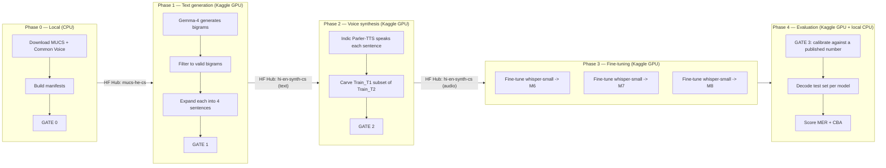

# Architecture — how this pipeline actually works

This document explains every component of the codebase, in the order data
flows through it. The [top-level README](../README.md) is the lab notebook —
results, deviations, gotchas discovered along the way. This document is the
map: what each piece of code is *for*, and why it exists in the shape it does.

If you want the *concepts* rather than the map — what code-switching is, how
Whisper works, the MER and CBA formulae, and every term defined from scratch
— read [`LEARNING-GUIDE.md`](LEARNING-GUIDE.md) instead.

## The one-sentence version

We are testing a specific claim from a research paper — **"you don't need
real code-switched audio to teach Whisper to handle Hindi-English
code-switching; synthetic audio, generated by an LLM and a TTS model, is
enough"** — by rebuilding the paper's pipeline end to end and fine-tuning
`openai/whisper-small` on the result.

Everything below is in service of that one experiment: three models (**M6**,
**M7**, **M8**), differing only in how much synthetic (and, for M8,
real-but-out-of-domain) data they were trained on. If `M8 > M7 > M6 >
zero-shot`, the paper's claim survives replication.

## The five phases, at a glance



Every arrow between phases is a **Hugging Face Hub dataset**, not a file on
someone's disk. That is deliberate: Phase 0 runs on a laptop, Phases 1–3 run
on Kaggle (which gives you a fresh, empty machine every session), and Phase 4
runs on both. The Hub is the only thing both environments can see, so it is
the sole data contract between stages — see [Manifests](#manifests--the-data-contract)
below.

---

## Phase 0 — Local data preparation

**Goal:** get the real Hindi-English corpus (MUCS 2021) and a slice of Common
Voice into a normalized, verified shape, and publish them to the Hub. This
phase is CPU-only — no GPU, no torch needed.

### `csasr/data/download.py`

Downloads the two MUCS 2021 tarballs (train: 7.3 GB, test: 443 MB) from
OpenSLR 104 over plain HTTP. Supports resume via HTTP `Range` requests, so a
dropped multi-gigabyte transfer doesn't restart from zero. `extract()` then
unpacks the tarball, marking completion with a sentinel file so re-running is
a no-op.

### `csasr/data/prepare_mucs.py`

MUCS ships as a **Kaldi-style corpus**: a `text` file (`utt_id → transcript`),
a `segments` file (`utt_id → recording, start, end`), and `wav.scp`
(`recording → audio path`). `scan()` discovers these files by name rather
than hardcoding paths, because the train and test tarballs are laid out
slightly differently. `build_manifest()` turns them into one JSONL row per
utterance, optionally cutting each utterance's audio span out of the parent
recording (`--cut-audio`) and resampling to 16 kHz mono 16-bit.

Track 2's central rule shows up here concretely: the 89.8-hour **train**
split is only ever prepared `--text-only` (its transcripts are used as
few-shot exemplars for the LLM, never as training audio). Only the 5.2-hour
**test** split and a seeded 4-hour **dev** slice carved out of train ever get
their audio cut.

### `csasr/data/prepare_cv.py`

Pulls ~15 hours each of Common Voice Hindi and English — used only by **M8**,
as auxiliary monolingual audio. This one has a real fight hidden in it:
Mozilla emptied the official `mozilla-foundation/common_voice_17_0` Hub repo
in October 2025, so this reads a CC0 mirror (`fsicoli/common_voice_17_0`)
directly by its file layout rather than through `datasets.load_dataset`
(whose loading script is broken against that mirror). It streams the audio
`.tar` shards straight over HTTP with Python's `tarfile` in streaming mode
and **stops as soon as the hour target is hit** — English's `train` split
alone is 45 GB across 28 shards, of which maybe a few hundred MB is ever
touched. Splits are walked smallest-metadata-first (`dev → test → train →
other`) for the same reason. A per-speaker cap (`--max-per-speaker`) keeps
one prolific contributor from dominating the sample.

### `csasr/data/push_to_hub.py`

Publishes a JSONL manifest to the Hub as a Parquet dataset, FLAC-encoding any
audio (roughly half the size of raw PCM, losslessly). `verify_round_trip()`
re-downloads what was just uploaded and checks row count, total duration, and
sample rate against the source manifest — cheap insurance against silently
training on a corrupted upload.

### `csasr/data/loaders.py`

The read-side counterpart used by every later stage: `load_hub_dataset()`
pulls a config from the Hub, `load_manifest_dataset()` does the same from a
local JSONL (used by tests), `apply_subset()` filters a dataset down to an id
list (this is how **Train_T1** is carved out of **Train_T2** without copying
any audio — see [Phase 2](#phase-2--voice-synthesis)), and `concat()` merges
datasets onto a common schema (this is how M8 merges synthetic + Common Voice
audio into one training set).

### The two primitives everything else rests on

**`csasr/lid.py`** — word-level **language identification by script**, not by
model or lexicon. Hindi is Devanagari, English is Latin; a word is tagged
`HI`, `EN`, `MIXED` (both scripts in one whitespace token — usually a typo
with a dropped space, like `दायाँclick`), or `OTHER` (digits, punctuation).
Two non-obvious details live here because they're easy to get wrong and
corrupt everything downstream:

- The Devanagari danda (`।`) and Devanagari digits sit *inside* the
  Devanagari Unicode block but are not letters. Classifying by block alone
  would count bare punctuation as a Hindi word.
- Dropped-space typos in the real corpus (`दायाँclick`, `करेंspoken`) hide a
  genuine code-switch point inside one token. `split_script_boundaries()`
  splits exactly at the script change, recovering that switch point.

This module also defines what a **code-switch bigram** is (`cs_bigrams()`):
any adjacent word pair where the language flips, Hindi→English (`HE`) or
English→Hindi (`EH`). Every downstream count — Gate 0's word counts, the
bigram generation stage, the CBA metric — is built on this one function.

**`csasr/normalize.py`** — text normalization, deliberately *not*
`transformers`' `BasicTextNormalizer`. That normalizer strips every Unicode
character in categories M/S/P, and Devanagari vowel signs and the virama are
combining marks (category `Mn`/`Mc`) — so it shatters `दस्तावेज़` into four
garbage fragments. This module strips only punctuation and symbols (`P`/`S`),
preserving every combining mark. The destructive version is kept as
`whisper_basic`, wired into Gate 0 purely as a regression guard that must
visibly fail.

### `csasr/manifest.py` — the data contract

A tiny dataclass (`Utt`) plus `read_jsonl`/`write_jsonl`/`append_jsonl`.
**Every stage in this pipeline reads a manifest, writes a manifest, and never
passes a Python object to another stage in-process.** That is what makes each
stage independently resumable and portable between a laptop, a Kaggle
session, and the Hub — see [Manifests](#manifests--the-data-contract) below for why
this matters as much as it does.

### GATE 0 — `scripts/verify_table1.py`

The paper publishes exact word and code-switch-bigram counts for its train
and test splits (Table 1). Reproducing them pins down tokenization,
normalization, and language ID all at once — nothing downstream is
interpretable until this passes. It asserts against the **test** split (the
split every later metric is computed on) and only integrity invariants
against **train**, because the publicly released train transcripts
demonstrably cannot reproduce the paper's train counts no matter the
tokenizer (documented in the README's Gate 0 section) — and it doesn't need
to, since Track 2 only uses train text for few-shot prompting.

---

## Phase 1 — Text generation

**Goal:** generate thousands of natural Hindi-English code-switched
sentences, using only an LLM and the real corpus's transcripts as style
exemplars — no real code-switched audio touches this phase at all. Runs on
Kaggle (needs a GPU to serve the LLM at any reasonable speed).

### `csasr/llm/backend.py` — three interchangeable model servers

An abstract `LLMBackend` with one required method, `_generate()`, plus a
shared `chat()` wrapper that adds **caching** and **batching** for free. Three
implementations:

- **`LlamaCppBackend`** (default). Serves `unsloth/gemma-4-26B-A4B-it-GGUF` —
  a 25.2B-total/3.8B-active mixture-of-experts model, quantized to ~16 GB —
  via `llama-cpp-python`. That doesn't fit one T4, so `tensor_split` spreads
  *one* model across both of Kaggle's GPUs (there's no cross-GPU sharding
  here — it's one process, one model, two cards). Generation is single-stream
  (llama.cpp's chat completion API doesn't batch), so disabling the model's
  chain-of-thought (`disable_thinking`) is what keeps a multi-thousand-call
  run feasible at all.
- **`TransformersBackend`**. bitsandbytes 4-bit quantization + real batched
  `generate()`, so it *does* shard across GPUs. Kept as the alternative path
  (used by earlier runs with the smaller dense `gemma-4-E4B`). This class
  carries three defensive checks worth knowing about, because each one
  silently produces garbage if skipped: Gemma 4 is a multimodal checkpoint
  that only some `AutoModelFor*` classes bind to; Gemma 2's chat template
  rejects a `system` role outright (handled by folding it into the first user
  turn); and Gemma's config declares `bfloat16`, but the T4 (Turing) has no
  bf16 support, so fp16 activations can silently overflow to `inf`/`NaN` — a
  post-load logits healthcheck catches this and reloads in float32 if needed.
- **`EchoBackend`**. A deterministic canned-response stub used only by unit
  tests — no model, no GPU, no network.

`strip_thinking()` is a small but important piece of hygiene: reasoning
models wrap scratch-work in `<think>` blocks or Harmony-style
`<|channel|>` markers, and if that leaked through it would end up **spoken by
the TTS** and **learned by Whisper**. It's stripped defensively regardless of
which convention the model used.

### `csasr/llm/cache.py` — why any of this survives a 12-hour session cap

Every LLM request is hashed (model + messages + sampling params + sample
index) and the response appended to a JSONL the instant it returns. A
re-run of the same script first checks this cache and skips anything already
done. This is the single mechanism that makes an 8–12 hour generation run
survivable on a platform that kills your session at 12 hours: kill it, resume
it, and only the missing tail is ever recomputed.

### `csasr/llm/prompts.py` — transcribed verbatim from the paper

The bigram-generation and sentence-generation system/user prompts are quoted
directly from the paper's §3.2.1/§3.2.2, not paraphrased — including its
three few-shot examples, which the paper's own PDF-to-text extraction mangled
into transliterated garbage (`pr-tEt document`). Those three are recovered
here by tracing them back to the one MUCS test sentence they're lifted from.
The translation-check prompt (verifying two words aren't just translations of
each other) has no verbatim text in the paper — it's described but not
quoted — so that one prompt is original to this repo, clearly marked as such.

### `csasr/llm/gen_bigrams.py` — Stage 1a

Repeatedly prompts the LLM with five random real MUCS sentences as few-shot
context, asking for ten Hindi-English bigrams per call (paper: "batches of
five... sentences", few-shot). `parse_bigrams()` is deliberately lenient
about the model's output format — the *raw* yield count (before any
filtering) is itself a statistic compared against the paper's reported
44,657→5,932 dedup ratio, so throwing away malformed lines here would make
that comparison meaningless. Supports `--shard`/`--num-shards` so two
processes (one per Kaggle GPU) can split the call list.

### `csasr/llm/filter_bigrams.py` — Stage 1b

Two filters, applied in order, matching the paper's own description of what
it filtered:

1. **Script filter** (free, deterministic) — `script_filter()` extracts the
   first Hindi↔English script-crossing adjacent pair from a candidate phrase.
   This is written to *extract* rather than strictly *validate* two-token
   phrases, because the paper's 70B model reliably produced exactly two
   words and this repo's much smaller model does not (it appends a third,
   e.g. `बुनियादी formatting basics`) — demanding exactly two tokens would
   discard genuinely valid switch points. `--strict-bigrams` restores the
   paper-literal two-token-only behavior.
2. **Translation check** (LLM) — rejects pairs that are just a word and its
   own translation (e.g. `दस्तावेज़ document`). Sampled three times at
   temperature 0.7 with majority voting, because a much smaller judge model
   than the paper's is noisier and self-consistency helps.

### `csasr/llm/gen_sentences.py` — Stage 2a

For each valid bigram, asks the LLM for four sentences using it — two with
English as the main (matrix) language, two with Hindi (paper's instruction,
verbatim). Every returned sentence is **validated**, not trusted: it must
contain the bigram as an adjacent pair (in either order — a reversed
placement is still a useful `HE`/`EH` training example) and carry both
scripts, via `validate()`. `matrix_lang()` assigns the sentence's dominant
language by an actual word-count majority rather than trusting whichever
label the model prefixed its own output with.

### `csasr/llm/fix_sentences.py` — a post-hoc repair pass

Discovered after generation had already run and been pushed to the Hub:
Gemma 4 prefixes many sentences with a literal `"English: "` / `"Hindi: "`
label. Left in, that label would be **spoken aloud by the TTS** and then
**learned by Whisper as real text** — quietly poisoning the entire synthetic
corpus with a phantom token. This script re-cleans an already-generated
`sentences.jsonl` in place (strip the label, re-validate against the
bigram, recompute the matrix language, dedup) without re-running the LLM —
seconds instead of hours.

### `csasr/llm/smoke.py` — the one-minute check before the multi-hour run

Loads the model, fires a couple of generation calls, and reports: does it
load at all on this GPU; are its logits finite; does it produce usable
switch points; how many survive the script filter. This exists so a broken
config (wrong dtype, wrong model, bad quantization) fails in about a minute
instead of two hours into an unattended run. **Must run as a subprocess**,
never inside the notebook kernel — Jupyter's `Out[]` history keeps live
references to anything a cell produced, so `del model` does not actually free
GPU memory, and the next process to load a model fails with a confusing
CPU/disk-offload error.

### GATE 1 — bigram/sentence yield ratios

Not a standalone script; the target ratios (raw bigrams, unique, valid,
sentence count) live in `configs/llm.yaml`'s `expect:` block and are printed
by `gen_bigrams.py`/`gen_sentences.py` as they run, compared directly against
the paper's own published yield ratios (13.3% dedup survival, 92.3% filter
survival).

### GATE 1.5 — `scripts/audit_sentences.py`

Gate 1 only counts sentences; it says nothing about whether they're any
*good*. This runs **before** committing 4–6 hours of TTS to the corpus and
checks: label leakage (the `"English: "` prefix problem above), monolingual
rows (dead weight — no switch point survives), script mix versus the real
corpus, code-switch density, English vocabulary overlap with the real domain,
and a rough projected TTS duration (using an empirical words-per-second rate
for Indic TTS) so you know you're headed for ~8h or ~22h *before* spending
the compute.

### `scripts/grammar_probe.py` — measuring deviation D14

A diagnostic, not a gate: it measures whether the synthetic sentences are
structurally the same *kind* of code-switching as real speech. Real
Hindi-English tutorial speech is **insertional** — a Hindi sentence frame
with short English technical terms dropped in (mean English run ≈1.7 words).
If the synthetic text is instead **alternational** — whole English clauses
alternating with Hindi — that reads as bad cross-language grammar and trains
Whisper's decoder (itself an autoregressive language model) on the wrong
register. This script computes contiguous same-language run lengths and
matrix-language splits for both corpora side by side, which is how deviation
D14 in the README was actually discovered and quantified.

---

## Phase 2 — Voice synthesis

**Goal:** turn every validated sentence into a spoken audio clip, and carve
the paper's two training sets (**Train_T1**, 8h; **Train_T2**, 22h+) out of
the result. Runs on Kaggle under a *different* `transformers` version than
Phase 1 (see [Why the notebooks are split](#why-the-notebooks-are-split)
below) — this is why text generation and audio synthesis are separate
notebooks with the Hub as the checkpoint between them.

### `csasr/tts/speakers.py`

The paper synthesizes with one Indian male and one Indian female voice; this
uses `ai4bharat/indic-parler-tts`'s model-card-recommended Hindi pair, Rohit
and Divya. `assign_speaker()` picks between them with a stable SHA-1 digest
of the sentence id, deliberately **not** Python's built-in `hash()` — that's
salted per-process (`PYTHONHASHSEED`), so a run resumed after a Kaggle
timeout would reassign voices mid-corpus and produce inconsistent
speaker/sentence pairings on resume.

### `csasr/tts/synthesize.py` — Stage 2b

For each sentence, builds a natural-language *voice description* (Parler-TTS
is prompted with text like "Rohit speaks at a moderate pace...") plus the
sentence text itself, and generates audio. Three details matter here:

- **Sharded and resumable** (`--shard`/`--num-shards`): a clip that already
  exists on disk is never regenerated, so a session that dies at the 12-hour
  cap costs at most the one batch that was mid-flight.
  **Length-sorted batching**: Parler-TTS decodes autoregressively over audio
  codec frames, so batching similar-length sentences together minimizes
  wasted padding.
- **The model's real sample rate is read at runtime**
  (`model.config.sampling_rate`), not assumed from the model card, which
  states 22.05 kHz while the model actually emits 44.1 kHz. Output is
  resampled to 16 kHz (Whisper's rate) and written as **int16 PCM**, never
  float32 — the float32 intermediate at 44.1 kHz would balloon a 22-hour
  corpus to ~7 GB versus ~2.5 GB as 16-bit.
- **Trailing-silence trim** (`trim_silence()`): batched generation pads
  shorter clips in a batch with codec silence, which would otherwise inflate
  every clip's measured duration (and thus the corpus's total-hours count).
  Clips outside a 0.5–30s window after trimming are dropped as TTS collapse.

### `csasr/tts/make_subset.py`

Builds **Train_T1** (paper: 8 hours) as a *by-reference* subset of
**Train_T2** — a JSON list of utterance ids, applied at load time via
`apply_subset()` (see [loaders.py](#csasrdataloaderspy) above), rather than
copying ~1 GB of audio that's already sitting in T2. Selection round-robins
across bigram groups (`select_subset()`) so the 8-hour subset spreads across
as many distinct code-switch points as possible instead of over-sampling a
few bigrams that happened to get many sentences. Three assertions guard the
one thing that must never silently go wrong here: every T1 id must actually
exist in T2, contain no duplicates, and be a *strict* subset (not equal to
all of T2).

### GATE 2 — automated checks + spot-listening

Checked at the end of Stage 2: `Train_T1 ⊆ Train_T2`, durations land near 8h
and 22h, and (the one step that can't be automated) a human spot-listens to a
sample of clips — flagged as mattering more than usual here, since
Parler-TTS fed syntactically odd text (deviation D14) is exactly where
prosody quietly collapses in a way no duration filter would catch.

### GATE 2b — `scripts/verify_gate2.py`

A narrower, sharper check than Gate 2's own assertions: `t1_ids.json` is
uploaded to the Hub as a *separate* raw file from the Train_T2 parquet it
references. Nothing else checks that the ids inside it actually match the
`utt_id` column of what's actually sitting on the Hub — if they didn't, M6's
`.filter()` would silently select **zero rows**, and M6 would train on
nothing without ever raising an error. This script downloads (or reads
locally) both sides and asserts the join holds.

---

## Phase 3 — Fine-tuning

**Goal:** fine-tune `openai/whisper-small` three times, varying only the
training data, producing checkpoints **M6**, **M7**, **M8**. Runs on Kaggle
(needs a GPU; full fine-tuning of a 244M-parameter model doesn't fit in
CPU-reasonable time).

### `csasr/train/collator.py`

The batch-collation logic for Whisper's encoder-decoder architecture, with
two details that silently corrupt a training run if missed:

1. **Label padding must be `-100`**, the value PyTorch's cross-entropy loss
   is told to ignore — not the tokenizer's actual pad token id, or the model
   would be trained to predict pad tokens as real output.
2. **The leading decoder-start token must be stripped from labels.** The
   tokenizer's output already begins with
   `<|startoftranscript|><|hi|><|transcribe|><|notimestamps|>`, but the
   `Seq2SeqTrainer`/model *also* prepends `decoder_start_token_id` itself
   when constructing `decoder_input_ids`. Leaving both in shifts the whole
   label sequence by one position, and the model quietly learns to predict
   its own beginning-of-sequence token instead of the first real word.

### `csasr/train/train_whisper.py` — Stage 3

A `Seq2SeqTrainer`-based script that keeps the paper's optimizer recipe
intact: full fine-tune (no LoRA/quantization — whisper-small's 244M
parameters comfortably fit a T4 with room for optimizer state), AdamW,
learning rate 2e-5, effective batch size 64 (`batch_size=16 ×
grad_accum=4`), up to 5,000 steps with early stopping (`patience=4`) on dev
MER. A few implementation choices worth knowing:

- **`fp16=True`, never `bf16`** — the T4 is a Turing-generation GPU with no
  bf16 support at all.
- **`gradient_checkpointing=True`** trades recomputation for memory, which is
  what makes full fine-tuning (versus LoRA) fit.
- **`TOKENIZERS_PARALLELISM=false` is set before any `transformers` import**,
  specifically because `datasets.map(num_proc>1)` forks the process, and a
  forked child that inherits the parent's already-initialized fast-tokenizer
  thread pool deadlocks silently — the progress bar sits at 0% forever with
  no CPU activity, which looks like "slow" but is actually "hung forever."
- **`extra_hf`** is how M8 differs from M7 at the data layer: it concatenates
  the Common Voice Hindi/English configs onto the synthetic training set via
  `concat()`.
- The **dev set is decoded with `predict_with_generate=True` and
  `language=None`** during training, so checkpoint selection tracks the same
  auto-detect condition the test set will ultimately be scored under, rather
  than optimizing against an easier, language-forced proxy.

### The three configs: `configs/train_m6.yaml`, `train_m7.yaml`, `train_m8.yaml`

These are the *only* difference between M6, M7, and M8 — everything else
(model, optimizer, schedule) is identical by design, so any MER/CBA gap
between them is attributable to training data alone:

| | Training data | What's being tested |
|---|---|---|
| **M6** | Train_T1 (~8h synthetic), via `subset_ids: t1_ids.json` | does *any* synthetic data help over zero-shot? |
| **M7** | Train_T2 (~22–25h synthetic), full set | does *more* synthetic data help further? |
| **M8** | Train_T2 + Common Voice Hindi (15h) + Common Voice English (15h), via `extra_hf` | does adding real (but out-of-domain, monolingual) audio help on top? |

All three still use a single `<|hi|>` language prompt for every training
example — language-specific prompting per config is a different track in the
paper (Track 1's M4), not this one.

---

## Phase 4 — Evaluation

**Goal:** measure how well each checkpoint transcribes *real* code-switched
speech, using the two metrics the paper reports (MER, CBA), computed the same
way for every system so the M6 < M7 < M8 comparison is apples-to-apples. Runs
partly on Kaggle (decoding needs a GPU) and partly on a local CPU (scoring
does not).

### `csasr/eval/decode.py` — Stage 4

The single most consequential design decision in the evaluation phase:
**decode whole recordings, not isolated utterance clips.** The paper's own
tool (WhisperX) transcribes a full recording — detecting language once, and
feeding Whisper 30-second chunks with real surrounding audio context.
Decoding the 3,136 short (~6s) test clips one at a time is a meaningfully
*harder* task for Whisper, and it silently destroys what the CBA metric
measures: with no context, Whisper renders English loanwords back into
Devanagari, so the hypothesis text contains no script boundary at all and
**no code-switch bigram can ever match, for any model.** This was caught
empirically (see the README's "Gate 3 caught a real bug" section) — the
first attempt at per-clip decoding measured a hypothesis with 0.0% Latin
script against a 21.6%-Latin reference.

`--engine faster-whisper` (the default) uses the same underlying engine
WhisperX wraps, with OpenAI's full decoding heuristic stack: beam search,
temperature fallback across six temperatures, a compression-ratio check that
aborts repetition loops (Whisper degenerating into `तो तो तो तो...`), and
crucially `--lang-detect-segments 8` — voting language detection over eight
30-second windows instead of faster-whisper's default of one, because
Whisper confuses Hindi and Urdu constantly (same spoken language, different
script) and a single unlucky window can send an entire recording's decode
into the wrong script family, where no Hindi↔English bigram can possibly
match. `--batch-size 16` batches VAD-detected speech chunks together for
decoding rather than looping one at a time — this is literally the technique
that makes WhisperX "70× realtime," and measured an 8× speedup here (253s →
32s on whisper-small over 181s of audio). `--num-shards` splits whole
recordings (never a recording mid-way) across Kaggle's two GPUs.

An alternate `--engine transformers` path exists as a fallback/cross-check,
supporting both recording-level and per-segment decoding (the latter used
only as a faster, less faithful proxy metric during training-time checkpoint
selection).

### `csasr/eval/grouping.py`

The plumbing that makes recording-level decoding possible without extra
metadata: MUCS utterance ids are shaped `<speaker>_<recording>_<index>`, and
the trailing index is chronological within the recording (verified against
the corpus's own `segments` file for every test recording). `group_by_recording()`
buckets and orders utterances back into their parent recordings from the id
alone; `concat_refs()` joins a recording's reference utterances into one
string for MER scoring.

### `csasr/eval/ct2.py`

`faster-whisper` runs **CTranslate2** models, not raw Hugging Face
checkpoints. OpenAI's own model sizes have prebuilt CT2 conversions on the
Hub (used directly); this repo's own fine-tuned checkpoints (M6/M7/M8) do
not, so `resolve_ct2()` converts them once, on first use, and caches the
result on disk — the second decode of the same checkpoint is free.

### `csasr/eval/mer.py` — Mixed-language Error Rate

The paper's MER definition traces to Zhang et al.'s SEAME metric for
Mandarin-English: character-level scoring on the Mandarin side (Mandarin
isn't whitespace-segmented), word-level on the English side. Hindi *is*
whitespace-segmented, so the literal SEAME reading (`mode="hybrid"`:
Devanagari scored per-character, Latin scored per-word) and the simpler
plain word-level reading (`mode="word"`, the default) are genuinely different
metrics here, and the paper doesn't specify which it used. **Gate 3 settles
this empirically**: whichever mode lands zero-shot `whisper-large-v2` nearest
the paper's published 52.0 is treated as correct (turned out to be
`hybrid`, at 51.9 vs. the paper's 52.0). MER can legitimately exceed 100% —
it's `(substitutions + deletions + insertions) / reference_length`, and a
model that mis-detects the language and transliterates freely can insert
without bound (observed: whisper-tiny zero-shot scored MER 125%).

### `csasr/eval/cba.py` — Code-Switch Bigram Accuracy

The paper's second metric: "correctly recognized bigrams at switch points
relative to their total count in the test set." Three subtleties, each
discovered the hard way and documented in the module's own docstring:

- **The denominator must come from reference *utterances*, not concatenated
  recordings.** Concatenating a recording's utterances before extracting
  bigrams invents ~1,000 spurious switch pairs that straddle two utterances'
  join point — pairs that appear nowhere in any actual reference sentence.
  This inflated the denominator 23% and silently halved the measured score
  before being caught. `cba_grouped()` is built specifically to decode at
  recording level while still counting the denominator per-utterance.
- **"Correctly recognized" is never defined by the paper.** This module
  implements two readings and reports both: `mode="adjacent"` (both words
  correct *and* still adjacent in the hypothesis — the literal reading of
  "bigram") and `mode="lenient"` (both words recognized anywhere in the
  hypothesis, adjacency not required). Measured against the paper's own
  published large-v2 zero-shot numbers, `lenient` reproduces their HE score
  almost exactly (43.8 vs. 42.9) while `adjacent` lands at roughly half
  (20.1) — but `adjacent` is kept as the default because it's the
  defensible literal reading, and the choice doesn't affect the actual
  experiment: every system (M6/M7/M8/zero-shot) is scored identically either
  way, so the ordering the experiment tests is preserved under both.
- **Multiset, not set, semantics.** The paper's own Table 1 counts 4,189 HE
  bigram *tokens* against only 2,347 unique *types* — meaning a bigram that
  recurs three times in the reference should be able to contribute up to
  three matches, not be capped at one by naive set intersection.

### `csasr/eval/score.py`

The CPU-side entry point: reads a hypotheses JSONL (from `decode.py`) and a
reference manifest, applies MER and CBA with the `scoring` normalization
preset (punctuation stripped, Devanagari combining marks preserved — see
[normalize.py](#the-two-primitives-everything-else-rests-on)), and prints/appends
a JSON result. `--group recording` is the flag that tells it the hypotheses
are per-recording while the reference manifest is still per-utterance, which
is exactly the shape `decode.py --mode recording` produces.

### GATE 3 — zero-shot calibration, *before* generating anything

Not a check on this repo's own output — a check on the **measuring
instrument itself**. Before spending any compute on LLM generation or TTS,
`whisper-large-v2` is run zero-shot (no fine-tuning at all) against the real
test set, and the resulting MER/CBA is compared to the paper's own published
zero-shot row (52.0 MER / 42.9 CBA-HE). If decoding, normalization, language
ID, or either metric's definition were subtly wrong, this is where it would
surface — and it did, on the first attempt (MER 75.6 vs. expected 52.0),
which is what led directly to the recording-level decoding fix described
above. Only once Gate 3 passes is it safe to trust any number this pipeline
produces about M6/M7/M8.

---

## Cross-cutting pieces

### Manifests — the data contract

Worth calling out on its own, because it's the architectural decision that
makes the whole multi-environment pipeline (laptop → Kaggle → Hub → Kaggle →
laptop) actually work: **no stage ever hands another stage a live Python
object.** Every stage reads a JSONL manifest (locally) or a Hub dataset
config (remotely) at its start, and writes one at its end. Two consequences
fall out of that one rule for free — a stage can be killed and resumed
without losing anything upstream (paired with the LLM response cache, this is
what survives Kaggle's 12-hour session cap), and a stage can run in a
completely different Python/CUDA/`transformers` environment than its
neighbor, because the only thing crossing the boundary is a JSONL/Parquet
file — no shared process, no shared virtualenv.

### Why the notebooks are split

Two hard, irreconcilable dependency conflicts force the pipeline into four
separate Kaggle notebooks rather than one:

- `parler-tts` (Phase 2, TTS) hard-pins `transformers==4.46.1`; Gemma 4 (Phase
  1, text generation) needs `transformers>=5.5`. They cannot share a Python
  process, so `01a_generate_text` and `01b_synthesize_audio` are separate
  notebooks with the Hub as the checkpoint between them.
- Training (Phase 3) and evaluation (Phase 4) have their own version
  requirements and are naturally sequential besides, so they're also split
  out (`02_train`, `03_eval`).

### `scripts/build_notebooks.py`

The four Kaggle notebooks are **generated**, not hand-edited — this script
assembles them from Python string templates into valid `.ipynb` JSON.
Deliberately thin: every notebook cell just `pip install`s this package and
calls into `csasr`, so the actual logic lives in version-controlled,
unit-tested modules rather than being buried unreviewably in notebook cells.
Each generated notebook asserts `csasr.__version__` against the expected
version at startup, specifically because `pip install git+...` treats an
already-installed version as satisfied and silently skips reinstalling —
without this assertion, a Kaggle kernel that already ran once would keep
executing stale code even after a fix was pushed and the notebook re-run.

### The gates, end to end

| Gate | Script | What it protects against |
|---|---|---|
| **0** | `scripts/verify_table1.py` | Wrong tokenization/normalization/LID silently corrupting every downstream count |
| **1** | printed by `gen_bigrams.py` / `gen_sentences.py` | LLM generation yield drifting far from the paper's own reported ratios |
| **1.5** | `scripts/audit_sentences.py` | Spending hours of TTS compute on bad text (label leaks, monolingual rows, wrong duration) |
| **2** | manual, end of Stage 2 | Train_T1 ⊄ Train_T2, wrong durations, TTS prosody collapse |
| **2b** | `scripts/verify_gate2.py` | T1's id list not actually matching what's on the Hub → M6 silently trains on zero rows |
| **3** | `notebooks/03_eval.ipynb` zero-shot run | A broken decode/metric pipeline producing numbers that look plausible but are wrong |

---

## Running it

```powershell
py -3.11 -m venv .venv
.\.venv\Scripts\Activate.ps1
pip install -e ".[local,dev]"
pytest -q
```

**Stage 0** (local, CPU): `scripts/stage0.sh` runs download → prepare → Gate 0
→ Common Voice → push, end to end.

**Stages 1–4** (Kaggle, GPU): upload `notebooks/` and run
`01a → 01b → 02 → 03` in order, on a T4×2 instance with an HF write token in
Kaggle Secrets as `HF_TOKEN`.

Scoring (`csasr.eval.score`) runs back on a local CPU against the
hypotheses `03_eval` produced on Kaggle.

For the full list of deviations from the paper (model substitutions, dataset
availability issues, and what each one costs the replication), see the
[README's deviation table](../README.md#deviations-from-the-paper) — this
document explains what the code does; the README explains where and why it
had to differ from the paper.
